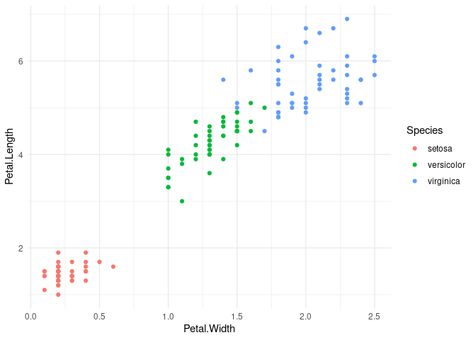

<!-- README.md is generated from README.Rmd. Please edit that file -->

# mytoolsPackage

<!-- badges: start -->
<!-- badges: end -->

The goal of mytoolsPackage is to …

## Installation

You can install the development version of mytoolsPackage like so:

``` r
# install.packages("devtools")
devtools::install_github("m-mburu/mytoolsPackage")
```

## Example

This is a basic example which shows you how to solve a common problem:

``` r
library(mytoolsPackage)
## basic example code
```

What is special about using `README.Rmd` instead of just `README.md`?
You can include R chunks like so:

``` r
data("iris_data")
my_summary(df = iris_data,
           by = "Species")
#>       Species    V1 Sepal.Length Sepal.Width Petal.Length Petal.Width
#> 1:     setosa  25.5        5.006       3.428        1.462       0.246
#> 2: versicolor  75.5        5.936       2.770        4.260       1.326
#> 3:  virginica 125.5        6.588       2.974        5.552       2.026
```

``` r
myScatter(df = iris_data,
          x = Petal.Width , 
          y = Petal.Length , 
          col_var = Species)
```


